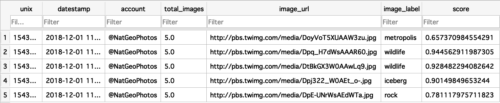

# API-miniproject
This is the mini project from EC601.

Author: Min Zhou

Email: minzhou@bu.edu

## MySQL database
To test the MySQL database:
1. Follow the Installation steps 1 to 4.
2. Run:
```
python mysql.py
```
Test output:
```
$ python mysql.py 
Please enter the Twitter Account:(ex:@NatGeoPhotos) @NatGeoPhotos
Enter the number of images to download: 5
Enter consumer key: **********************
Enter consumer secret: *****************************************
Enter access key: *****************************************
Enter access secret: *****************************************
100% [........................................................] 202437 / 202437
Successfully downloaded image001.jpg
100% [........................................................] 246119 / 246119
Successfully downloaded image002.jpg
100% [........................................................] 125915 / 125915
Successfully downloaded image003.jpg
100% [..........................................................] 85453 / 85453
Successfully downloaded image004.jpg
100% [........................................................] 298524 / 298524
Successfully downloaded image005.jpg

Image label detection using Google vision API:
Highest score: 0.66, Description: metropolis
Highest score: 0.94, Description: wildlife
Highest score: 0.93, Description: wildlife
Highest score: 0.9, Description: iceberg
Highest score: 0.78, Description: rock

Finished analysis!

Video successfully saved as result.mp4.

Video label analysis using Google vision API:

Processing video for label annotations:
Video label description: animal
	Confidence: 0.5281925201416016


Video label description: nature
	Confidence: 0.6764513850212097


Database successfully saved as twitter.db
```
twitter.db




## MongoDB database
To test the MySQL database:
1. Follow the Installation steps 1 to 4.
2. [Install MongoDB](https://treehouse.github.io/installation-guides/mac/mongo-mac.html)
3. Start the Mongo daemon in the above link.
4. Run:
```
python mongodb.py 
```
Test output:
```
$ python mongodb.py 
Please enter the Twitter Account:(ex:@NatGeoPhotos) @NatGeoPhotos
Enter the number of images to download: 5
Enter consumer key: **********************
Enter consumer secret: *****************************************
Enter access key: *****************************************
Enter access secret: *****************************************
100% [..........................................................] 68118 / 68118
Successfully downloaded image001.jpg
100% [..........................................................] 51306 / 51306
Successfully downloaded image002.jpg
100% [........................................................] 113673 / 113673
Successfully downloaded image003.jpg
100% [........................................................] 127599 / 127599
Successfully downloaded image004.jpg
100% [..........................................................] 88049 / 88049
Successfully downloaded image005.jpg

Image label detection using Google vision API:
Highest score: 0.96, Description: wildlife
Highest score: 0.95, Description: types of volcanic eruptions
Highest score: 0.97, Description: flower
Highest score: 0.96, Description: water
Highest score: 0.98, Description: reflection

Finished analysis!

Converting to video...

Video successfully saved as result.mp4.

Video label analysis using Google vision API:

Processing video for label annotations:
Video label description: nature
	Confidence: 0.8834792375564575


One post: 5c030844db0812876994cbc5

MongoDB posts created!

Retrieving the post with account is @NatGeoPhotos:

{'_id': ObjectId('5c030650db081286991de11a'), 'unix': 1543702059.1228101, 'datestamp': '2018-12-01 17: 07 39', 'account': '@NatGeoPhotos', 'total_images': 5, 'image_url': ['http://pbs.twimg.com/media/DtBkGX3W0AAwLq9.jpg', 'http://pbs.twimg.com/media/DrakVlpX4AABGk5.jpg', 'http://pbs.twimg.com/media/DpE-UNrWsAEdWTa.jpg', 'http://pbs.twimg.com/media/Ds96lUnWoAAbGr7.jpg', 'http://pbs.twimg.com/media/Dr6N5y6XcAcXMto.jpg'], 'image_label': [[0.9284822940826416, 'wildlife'], [0.9838229417800903, 'wildlife'], [0.7811179161071777, 'rock'], [0.9260057806968689, 'mammal'], [0.9668043255805969, 'beak']]}
```

## Description:
This a python library that downloads images from a twitter feed, convert them to a video and describe the content of the images in the video, and it also can output the label of the video.

## Useful software components:
- Twitter API
- FFMPEG
- Google Vision API, Google Intelligence Video API

## File instruction:
- `images/ ` is the folder to store the images collected by Twitter API.
- `api_mini_project.py` is the script to run the API.
- `ffmpeg_module.py`, `twitter_module.py` and `google_vision_module.py` are neccessary the first party libraries.
- `arial.ttf` is the font for labeling images.

## Installation:
- python 3
- [virtualenv](https://cloud.google.com/python/setup)
- Create a app using Twitter develper account, and get the Twitter API credential
- Enable [Google Vision API](https://cloud.google.com/vision/docs/), [Google Intelligence Video API](https://cloud.google.com/video-intelligence/docs/), and get your JSON service account file.

    _Note: this project is only tested on MAC OS._

### 1. Download this repository:
```
git clone https://github.com/minzhou1003/API-miniproject.git
```

### 2. Set up and activate virtualenv inside that folder.
```
cd API-miniproject
virtualenv --python python3 env
source env/bin/activate
```

### 3. Install python libraries:
```
pip install -r requirements.txt
```

### 4. Authenticate to Google API.

_Note: Before this step, you should enable both Google Vision API and Google Intelligence Video API to get the JSON credential first._
```
export GOOGLE_APPLICATION_CREDENTIALS="/absolute/path/to/your/Google/credential/json/file"
```

### 5. Run the test code:
```
python api_mini_project.py
```
_You will be asked to enter your Twitter API credential_.

### 6. Output result:
After successfully run the code, you will get downloaded images with labels and a `result.mp4` video inside the `/images` folder.

_Note: the "Highest score" is the most confident label predicted by Google Vision API._


## Sprint 1:
- [x] Study the general functions of all APIs
- [x] Define the function of each module
- [x] Implement a shell for the module

## Sprint 2:
- [x] Implement the twitter module

## Sprint 3:
- [x] Implement the FFMPEG module

## Sprint 4:
- [x] Implement the Vision module


## Test:
- [x] Test the FFMPEG module
- [x] Test the twitter module
- [x] Test the google-vision module
- [x] Test all parts

## Test code result: 

Tweet images from [@NatGeoPhotos](https://twitter.com/NatGeoPhotos)

Click on the image to see the video on YouTube:

[](https://www.youtube.com/watch?v=7jhDZyZXr1I)

```
Image label detection using Google vision API:
Highest score: 0.93, Description: bird
Highest score: 0.94, Description: water
Highest score: 0.98, Description: brown bear
Highest score: 0.96, Description: nature
Highest score: 0.99, Description: giraffe
Highest score: 0.96, Description: photograph
Highest score: 0.89, Description: fauna
Highest score: 0.9, Description: sky
Highest score: 0.94, Description: nature
Highest score: 0.95, Description: nature
Highest score: 0.98, Description: reflection
Highest score: 0.97, Description: sky
Highest score: 0.93, Description: tree
Highest score: 0.87, Description: arctic
Highest score: 0.96, Description: bird
Highest score: 0.95, Description: great ape
Highest score: 0.94, Description: bird
Highest score: 0.96, Description: cephalopod
Highest score: 0.87, Description: sky
Highest score: 0.98, Description: bird
Highest score: 0.7, Description: organism
Highest score: 0.96, Description: white
Highest score: 0.86, Description: stage
Highest score: 0.8, Description: wood
Highest score: 0.95, Description: nature
Highest score: 0.92, Description: ecosystem
Highest score: 0.88, Description: fauna
Highest score: 0.77, Description: poster
Highest score: 0.98, Description: fox
Highest score: 0.89, Description: water
Highest score: 0.97, Description: wildlife
Highest score: 0.93, Description: fauna
Highest score: 0.87, Description: tree
Highest score: 0.95, Description: sky
Highest score: 0.97, Description: flamingo
Highest score: 0.95, Description: sky
Highest score: 0.92, Description: sky
Highest score: 0.93, Description: mammal
Highest score: 0.92, Description: mammal
Highest score: 0.98, Description: reflection
Highest score: 0.9, Description: tree
Highest score: 0.92, Description: fauna
Highest score: 0.88, Description: dog
Highest score: 0.97, Description: squirrel
Highest score: 0.95, Description: sky
Highest score: 0.94, Description: sky
Highest score: 0.94, Description: ecosystem
Highest score: 0.95, Description: wildlife
Highest score: 0.97, Description: blue
Highest score: 0.95, Description: black
Highest score: 0.83, Description: black and white
Highest score: 0.84, Description: sky
Highest score: 0.94, Description: water
Highest score: 0.97, Description: lavender
Highest score: 0.97, Description: blue
Highest score: 0.97, Description: honey bee
Highest score: 0.98, Description: tree
Highest score: 0.98, Description: wildlife
Highest score: 0.55, Description: girl
Highest score: 0.96, Description: sky
Highest score: 0.98, Description: fireworks

...

Video label analysis using Google vision API:

Processing video for label annotations:
Video label description: wildlife
	Label category description: animal
	Confidence: 0.6899771690368652


Video label description: photography
	Confidence: 0.47163185477256775


Video label description: animal
	Confidence: 0.7916033267974854


Video label description: nature
	Confidence: 0.9364510774612427
```
